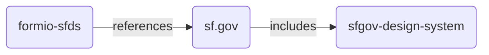
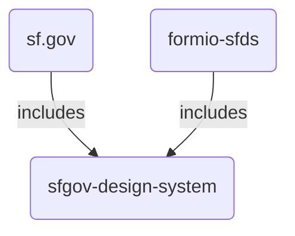

# Global CSS

* Status: **proposed**
* Deciders: @shawnbot @JimBrodbeck @nlsfds
* Date: 2022-04-21 <!-- when the decision was last updated -->

## Context and problem statement

Our form.io components are heavily reliant on global CSS on sf.gov. There are actually three separate projects (repos) at play here:

1. [formio-sfds](https://github.com/SFDigitalServices/formio-sfds) (this repo)
2. [design-system](https://github.com/SFDigitalServices/design-system)
3. [sfgov](https://github.com/SFDigitalServices/sfgov)

In order to move [DESSYS-155](https://sfgovdt.jira.com/browse/DESSYS-155) forward, we need to make a decision about how the three repos are connected.

## Decision drivers <!-- optional -->

* Time: we need to do this soon, without mucking around in postcss and/or Tailwind
* Maintenance/developer experience: if it's hard to set up or test, that will slow us down
* Ease of use: does this decision make forms easier or harder to use?
* Embedding: do we need to consider the use case of forms embedded outside of SF.gov?

## Considered Options

* [Use global CSS](#use-global-css)
* [Import CSS from the design system](#import-css-from-the-design-system)

## Decision Outcome

<!--
We've chosen to use global CSS because:

1. It's already set up that way; no additional postcss/Tailwind/etc. config necessary
2. We can start deleting CSS in the form.io theme sooner
-->

### Positive consequences <!-- optional -->

<!--
* We can start sooner and move faster
-->

### Negative consequences <!-- optional -->

<!--
Continuing to rely on global CSS:

* makes it harder to debug
* makes it harder to embed our forms on other sites (outside of SF.gov)
-->

## Pros and cons of the options <!-- optional -->

### Use global CSS

In this setup, we would rely (increasingly) on global CSS from SF.gov, which includes CSS (utility classes, etc.) from the design system:

* Good, because it requires fewer changes on the formio-sfds side
* Bad, because it makes testing with design system updates more complicated
* Bad, because it increases the form.io theme's reliance on global CSS
* Bad, because it makes forms harder to embed outside of SF.gov

### Import CSS from the design system

In this setup, both SF.gov and formio-sfds would pull the CSS they need from the design system:

* Good, because SF.gov and the form system can decide what they need (and don't)
* Good, because it's easier to test
* Bad, because it opens up the possibilty of different versions of the design system coexisting on SF.gov
* Bad, because it includes some duplicate CSS on the front end
